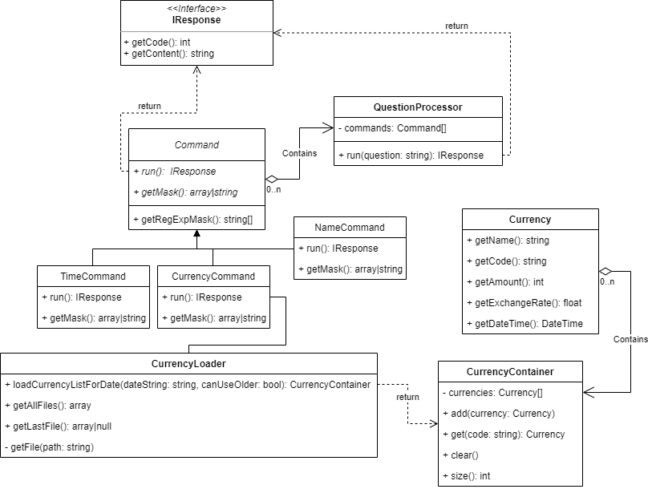

# STIN

Semestrální práce pro STIN 2021/22

# DPS
## Vývoj
**Analytik**: Vojtěch Voleman
**Vývojáři**: Vojtěch Voleman
**Datum zpracování**: 15.5.2022

## Informace o projektu
**Název projektu**: Chatbot
**Jazyk aplikace**: čeština
**Předpokládané datum dokončení:** 22.5.2022
### Základní popis
Aplikace umožňuje uživateli pokládat otázky a na předem připravené otázky získat odpovědi. Lze tedy aplikaci použít pro FAQ či složitější otázky, které například pro odpověd potřebují zpracovat množství dat.

## Technické podmínky
**Zabezpečení**: Token v URL adrese
**Jazyky**: PHP >=8.0
**Stabilní internetové připojení**

## Specifikace požadavků
### Uživatelské požadavky
- **Ověření uživatele**
	- Uživatel přistupuje do aplikace s tokenem v URL adrese.
	- Pokud je klíč správný, je uživatel vpustěn
	- Pokud není, je uživateli zobrana chybová hláška
- **Komunikace s chatbotem**
	-  Uživatel do textového vstupu zadá svojí otázku a stisknutím tlačítka "Odeslat" u textového vstupu či tlačítka "Enter" na klávesnici je otázka odeslána
	- Otázka se zpracuje na serveru a vrátí do chatovacího okna odpověď
	- Komunikace s chatbotem probíhá jen v českém jazyce
	- Server si nepamatuje předchozí otázky, nelze tedy vázat otázky na předchozí kontext
- **Otázky**
	- Mělo by být snadné přidávat další příkazy, i s parametrem
	- Aktuální otázky:
		- "Jaký je čas?"
			- Server vrátí aktuální čas
		- "Jak se jmenuješ?"
			- Server vrátí jméno chatbota
		- "Jaký je kurz /CURRENCY/?"
			- Vstupní parametr /CURRENCY/ musí být ve formátu shodném s API ČNB, tj. dle ISO 4217
			- Vrátí aktuální kurz měny
			- Seznam měn je limitován nabídkou API ČNB
			- Jako  /CURRENCY/ očekává server kód měny dle ISO 4217 (EUR, USD, CZK atd.)

### Systémové požadavky
- Klient / Server
	- Každá část aplikace běží samostatně.
	- Klient se dotazuje serveru pomocí API serveru přes AJAX.
	- Každý dotaz musí obsahovat token pro ověření.
	- Server běží na PHP 8.0, klient běží na JS.
- API ČNB
	- Aplikace očekává, že data z API ČNB (https://www.cnb.cz/) budou ve výměnném formátu CSV s oddělovačem `|` a s atributy:
		- První řádek je den, ke kterým všechny hodnoty náleží
		- Druhý řádek jsou atributy
			- `země` => plný název země měny
			- `měna` => plný název měny
			- `množství` => počet kusů měny, ke kterým se vztahuje cena
			- `kód` => kód měny dle ISO 4217
			- `kurz` => kurz měny s desetinnou čárkou `,` a 2 desetinnými místy
	- Pokud nebude možné z API data získat, použijou se poslední dostupná dat, tj. data z posledních dní
		- Tyto data jsou uložena na serveru po dobu 7 dní.
- Otázky
	- Otázka se vyhodnocuje dle největší shody a dle povinných slov otázky
- Měny
	- Data se se stahují jednou za den, automaticky na serveru ve 14:35
- Tokeny
	- Tokeny k zabezpečení stránky se uvedou v konfiguračním souboru.
	- Změna tokenů musí být provedena manuálně.

## Use Case diagram

## UML diagram

## Grafický návrh aplikace

